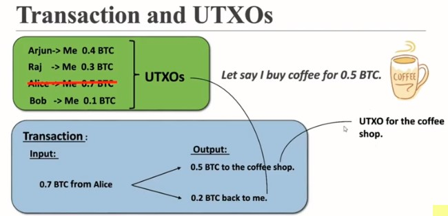
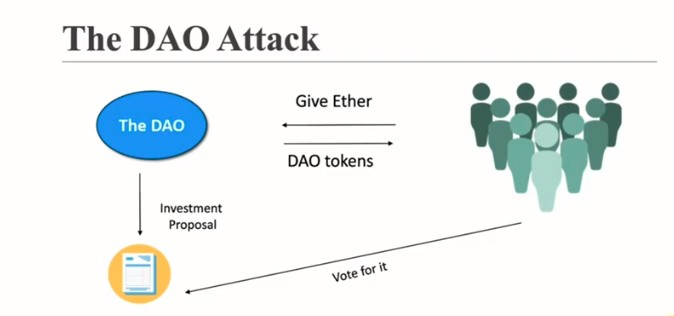

**Contents**

**Module A - Blockchain**

**What is Blockchain?**

Blockchain is a disruptive technology. A disruptive technology is a technology which can change traditional technology approach completely.
Blockchain provides trust. Blockchain is a distributed immutable ledger which is completely transparent and decentralized.

**Application of Blockchaing**

1. Product Tracking
2. Smart Contracts
3. Healthcare Systems
4. International Wire Transfer

**Hashing Algorithm**

SHA 256 Algorithm - This has 64 hexadecimal characters. Each character is of 4 bits. So in total it has 64*4 bits i.e. 256 bits.
Genesis Block - First block of blockchain.

**The five requirements of Hash Algorithm**
1. One Way - can not decrpty back.
2. Deterministic
3. Fast computation
4. Withstand Collisions
5. Avalanche Effect - Change in source lead to change in hash.

**Immutable Ledger**

Because blockchain is distributed and each block contain pre-hash hence if there is any change in data of any block, its hash will regenerate which will indicate mismatch with next block and also this blockchain instance will have mismatch with network blockchian. Which provides immutability to blockchain vs. ledger.

**Distributed P2P Networks**

Distributed networks consist of multiple peers. And each peer can have copy of data. In blockchain every miner has copy of blockchain. On mining new block by any miner will broadcast to the network, which will further verify by other nodes and finally added to the blockchain.

**What is Mining?**

When a new trasaction happen, it will fall into mempool. Miners will fetch the data from mempool and try to solve problem. On solving the problem it will add to blockchain and broadcast the information to the network then it verify by the other miners (proof of work) to validate and finally add to the blockchain.

Mining provide trust and security.

**Byzantine Generals Problem**

**How this Byzantine Fault Tolerance works in Blockchanin?**

The recovery machanism allows the algorithm to tolerate any number of faults over the lifetime of the system provided fewer than 1/3 of the replicas become faulty within a small window of vulnerability.

**Consensus Protocol**

Prevent Attacks

Types of Consensus Protocal:
1. Proof of Work (POW)
2. Proof of Stake (POS)
3. Others

Competing Chain Problem

When two nodes simulteanously try to add new block in blockchain. In that case, sub-networks which added new block first will lead to win of blockchain over other sub-networks and other sub-networks will orphan their in-between added blocks.

**Note**

1. The consensus protocol of blockchain is much better than the byzantine fault tolerance as consensus protocol only needs a 51% majority while byzantine fault tolerance needs approzimately 66%.
2. All the transaction in the orphan block will be dropped and the miner that had mined the block will not get any reward.
3. So that's why wait for the 6 confirmations before assuming payment to be successful.

**Module B - Cryptocurrency**

**What is Bitcoin?**

Bitcoin is a protocal. Which defines rules for Bitcoin Blockchain. Other protocols are waves, ethereum.

coinmarketcap.com

Founder: 2008 - Satoshi Nakamoto Bitcoin Script

**Bitcoin Ecosystem**

1. Miner
2. Node
3. Large Mines
4. Mining pool

**Bitcoin's Monetary Policy**

Launch of Bitcoin - 3 Jan 2009
The halving - After every 4 years or 210000 block. Maximum supply reached yr: 2140, block: 693000, coin: 21 million
Block Frequency - This states that on an average it will take 10 minute to create a new block.

blockchain.com/explorer

**Mining**

Transaction -> MemPool -> Miners -> Solve Mathematical Problem -> Miner Solved problem first add block -> Miners verify the validity -> Block is added and miner get reward.

**Nonce**

Nonce is a special number to generate block hash to reach the target hash value. The nonce is the number that blockchain miners try to solve.
Target:
1. Target is a number used in mining.
2. It is a number that a block hash must be below for the block to be added on to the blockchain.
3. The target adusts every 2016 blocks( roughly two weeks) to try and ensure that blocks are mined once every 10 minutes on average.

All Possible Hashes - A set of possible hashes form smallest to larget. A target is a value within all possible hashes.

demoblockchain.org/block

**CPU's vs GPU's vs ASCIs**

Central Processing Unit < 10 MH/s
Graphical Processing Unit < 1 GH/s
Application-specific Integrated Circuit > 1000 GH/s

Mining Pools - Group of miners to solve the same problem in combined way.
Nonce Range - 0 to 2^32 -1 ~= 0 to 4 * 10^9; 32 bit number
Total number of possible hashes = 16^64 ~= 10^77

**So what the miners do when all the nonce get exhausted and miners have not hit the target?**

Timestamp (unix time) - To save miners to exhausted from nonce timestamp has been introduced.

Current hashin rate - 180 Million Trillion Hashes/sec

**What should the miners do in idle time? Should they wait for timestamp to change?

**Mempool | How do mempool works?**

Pool of unconfirm transactions. In idle time miner can push unconfirm transactions from mempool and push to block and recalculate the hash. Lower free transaction will change by more lower fee trasaction to recalculate the hash to achieve the target.

Mempool is refreshed every 72 Hrs and trashes non picked transactions by miners.

**Trasactions and UTXOs**

UTXOs - Unspend Trasaction Outputs

Transaction Fee - Transaction initiator decides transaction fee for the minor to complete the transaction.

**Wallets**

Wallets add all the unspend transactions in blockchain for the owner to show total balance.

**Public key and private key**

tools.superdatascience.com

Private Key - is used to signature the message/transaction.

Public Key and Signature - is used to validate the message/transaction.

**Segregated Witness (segwit)**

Block Size: 1 MB in bitcoin

To send public key and signature separately as not part of block to reside more transactions in block to achieve high throughput.

Public key Vs Bitcoin Address

Bitcoin Address derived form the Public key and it is used to receive bitcoin

**Hierarchical deterministic (HD) wallets**

Master Private Key -> Private Key 1 -> Public Key 1 -> Address 1

Using master private key, we can generate multiple private, public and address

Master Public key - It can not used to make trasactions but it can use to track public keys activities.

**Module C - Smart Contract**

**What is Ethereum?**

Founder: 2013 Vitalik Buterin solidity

Ethereum is an open-source blockchain-based platform.

Ethereum Nodes
1. Full Node - Locally stores a copy of entire blockchain
2. Light Node - Stores only the block header. Depends on full node.
3. Archive Node - Stores everything kept in the full node and built an archive of historical data.

Ethereum Accounts

An Ethereum account is an entity with an ether (ETH) balance that can send or recieve transactions on Ethereum.

Account Types:
Externally Owned Account (EOA): 
When we create wallet at the same time externally owned acccount has been created.
To access the EOA, we can use private key.
Controlled by Human
No gas is associated
Has a unique address
Holds ETH balance

Contract Account (CA)
Contract Account used to deploy smart contract on enthereum blockchain.
No private/ public key needed.
Controlled by contract code
Gas is associated
Has a unique address
Holds ETH balance

**Smart Contract**

It is a program which runs on ethereum blockchain. It is contract between sender and reciever. To execute smart contract will require Gas.

Turing Complete - These lanaguages allows programer to program the logics.

Each node has the following:
Current state of all smart contracts.
History of both transaction and smart contract.

**Decentralized Applications (Dapps)**

Smart Contract - Backend
Front End - Client

Why use Decentralized Apps?
1. Trustworthy
2. No Censorship
3. They pay
4. Can never go down

**EVM and Gas**

EThereum Virtual Machine is used to run Dapps to protect actual machine from malicious applications.

Ethereum Gas: is used to run smart contract. Each operation has associted gas to perform.

Some important points to note:
Any transaction that modifies the blockchain costs gas.
The user that generated the transaction pays for the gas.

https://github.com/djrtwo/evm-opcode-gas-costs

Ethereum Gas Price: 

It is the amount the sender wants to pay per unit of gas to get the transaction mined. gasPrice is set by the sender.
Gas price are denoted in qwei. ( 1 gwei = 10^-9 ETH)
1 gas = 1000 gwei.
The higher the gas price the faster the transaction will be mined. It is just like transaction fee in Bitcoin.

Ethereum Gas Limit:

It is the maximum gas the transaction can consume.
Set by sender.

Example: A sets the gas price per unit = 100 gwei.
Transaction gas limit = 21000 units
Total fee = Gas limit * gas price
Total fee = 21000*100= 2100000
Total fee = 2100000 * 10^-9 ETH = 0.0021 ETH

etherscan.io/blocks

**Decentralized Autonomous Organization (DAOs)**

1. Full democratized.
2. Voting required.
3. No trusted intermediary to count vote.
4. Services offered are handled automatically.
5. All activity is transparent and fully public.

**The DAO Attack**

https://www.youtube.com/watch?v=_fIjUmwOhtU&list=PLgPmWS2dQHW-BRQCQCNYgmHUfCN115pn0&index=43

**Hard and Soft Fork**

Hard Fork: During a hard fork, software implementing a protocol and its mining procedures is upgraded.
Once a user upgrades their software, that version rejects all transactions from older software, effectively creating a new branch of the blockchain.
However, those users who retain the old software continue to process transactions.

Soft Fork: Soft forks are a change to the protocol, but the end product remains unchanged.
A soft fork is a backward-compatible upgrade, meaning that the upgraded nodes can still communicate with the non-upgraded ones.
Old nodes (not upgraded nodes) could still validate blocks and transactions (the formatting didn't break the rules), but they just wouldn't understand them.

**Initial Coin Offering (ICO)**

It offers tokens, which can be used later.
It don't cascade company control.
It don't have cumbersome legal requirements.

**Ethereum 2.0 (Serenity)**

Scalability
Security
Sustainibility

ETH2 Major Upgrades

Proof of Stake(POS) - Validator (32 ETH)

The more ether you pay the more chances of getting rendomly selected you have.

Proof of work (PoW)
Miners
High performance hardware required.
Lots of electricity required.
The more hashing power you have the more blocks you can validate.
Attack to happen 51% hashing power is required.
Competition is there.

Proof of Stake (PoS)
Validators
Mobile or Laptops are enough.
Not much electricity is required.
The more ETH you stake the more blocks you can validate.
Attack to happen 51% of stake is required.

Sharding Benfits
Transactions per second increase.
Powerful and expensive computes will not be needed.
More validators will join.
Energy consumption decrease.

Beacon Chain + Ethereum Mainnet = (Beacon Chain + Ethereum Mainnet ) + Shard Chain = (Beacon Chain + Ethereum Mainnet + Shard Chain)

**Alt Coins**

Not a bit coin
consensus protocol
new capabilities
As of march 2021, there were almost 9000 cryptocurriencies.
Ethereum and Binance Coin were the largest altcoins by market capitalization as of March 2021.

https://www.investopedia.com/terms/a/altcoin.asp